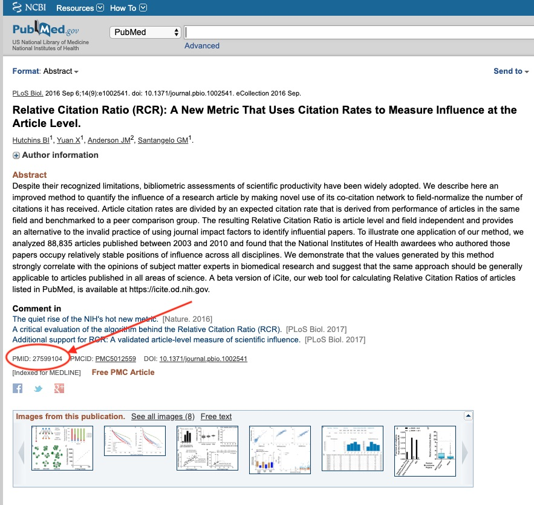

The iCiteR package is a minimal R package designed to help users retrieve data from the NIH's [iCite API](https://icite.od.nih.gov/api). There are two primary functions that will handle most of what the typical user will want. The first, `get_metrics` takes as input a vector of pubmed IDs and returns all the information yielded by the iCite API. The second allows a user to query the iCite API for pubmed entries that match a set of parameters.

### get_metrics
To use `get_metrics`, you will likely already have the PMIDs that correspond to the articles for which you wish to obtain data. For a given article in pubmed, the ID is also printed on the page



For a given PMID(s), one can get the relative citation rate and all other data returned by the iCite API as follows

```{r, include = FALSE}
knitr::opts_chunk$set(
  collapse = TRUE,
  comment = "#>"
)
```

```{r demonstration1}
library(iCiteR)
get_metrics('27599104')

```

The function also takes a vector of PMIDS:

```{r demonstration2}
get_metrics(c('27599104', '27830815', '28968388', '28968381'))

```

If you would rather not have the results in a dataframe, it is possible to obtain an S3 object for the data by using the `icite_api` function

```{r demonstration3}
dat <- icite_api('27599104')

print(dat)
```

If you are having trouble accessing the data for a particular PMID, the `icite_api` function will also return somewhat more informative error messages:

```{r demonstration4, error=TRUE}
icite_api('42')
```

It is worth noting that the iCite database presently goes back to 1995. Earlier papers will not have any data associated with them. Also, recent papers may not be available. See https://icite.od.nih.gov/stats and https://icite.od.nih.gov/help for details of the iCite system that this package works with.

### search_metrics
If you do not have a set of PMIDS you are interested in, then `get_metrics` may not seem to provide much use to you. Fortunately, the iCite API also provides a means of accessing data via some more general query parameters. In particular, you can ask for data from a given year, or from PMIDS that are above a certain value. This functionality is accessed with the `search_metrics` function.

For instance, if you wanted to get data from 50 papers in 2012 with PMIDS greater than 18000000:

```{r demonstration5}
dat_2012 <- search_metrics(year=2012, offset = '18000000', limit = '50')
```

By default, `search_metrics` will not return more than 1000 entries. If you wish to get more data than this, you can set page to `TRUE`. Using this setting with no specified limit may result in a function call that takes several hours to complete. A status message will be printed periodically to the console, but it is not possible to estimate a time to completion since the denominator (total number of entries to be obtained) is not known in advance. Informal testing suggests that there are around a million entries per year, but the database is constantly growing.
